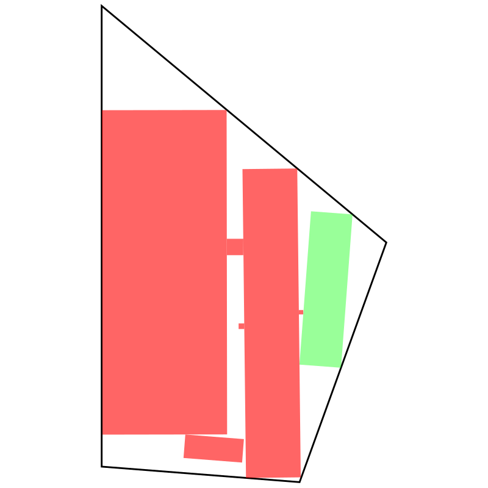

# Yard Rectangles Optimization

[](https://www.gnu.org/software/gcc/)
[](LICENSE)

---

## Overview

**Yard Rectangles** is a C program that uses evolutionary algorithms and light hill-climbing to find the largest possible rotated rectangle that fits within an irregular quadrilateral yard while avoiding obstacles such as trees, coops, and other structures.

The program is designed to be:

* **Fast**: Uses optimized geometric tests and OpenMP parallelization.
* **Robust**: Prevents overlap with obstacles using both AABB and SAT-based collision checks.
* **Flexible**: Handles arbitrary quadrilateral shapes and arbitrary small rectangular obstacles.

The output is an **SVG visualization** showing the yard, obstacles, and the optimal rectangle.


---

## Features

* Efficient evaluation of rotated rectangles using **half-space tests**.
* Precomputed bounding boxes (AABB) and axes for fast collision detection.
* Evolutionary optimization with:

  * Population-based selection
  * Elitism
  * Random injection
  * Annealed mutation
* Light repair and hill-climbing for improved rectangle placement.
* SVG output for easy visualization.

---

## Installation

Requires a **C compiler** with OpenMP support, e.g., `gcc`.

```bash
# On Arch Linux
sudo pacman -S gcc

# Compile the program
gcc -O3 -march=native -fopenmp yard_rects.c -o yard_rects -lm
```

---

## Usage

Run the compiled program:

```bash
./yard_rects
```

* The program prints progress and statistics to the terminal.
* When complete, it outputs an SVG file:

```text
output_yard_rects.svg
```

You can open this SVG in a browser or any vector graphics editor to view the yard, obstacles, and best-fit rectangle.

---

## How It Works

1. **Population Initialization**: Random rectangles within the yard are generated.
2. **Fitness Evaluation**: Rectangles are evaluated based on area and obstacle avoidance.
3. **Selection and Mutation**: Top-performing rectangles are used to produce the next generation with slight variations.
4. **Repair and Hill-Climbing**: Invalid rectangles are nudged or shrunk, and promising rectangles are optimized locally.
5. **Convergence**: The algorithm stops when the best solution hasn't improved for a set number of generations.

---

## Examples

SVG output shows:

* **Black polygon**: Yard boundaries
* **Red polygons**: Obstacles
* **Green polygon**: Largest rectangle found

Example usage:

```bash
./yard_rects
# Generates output_yard_rects.svg
```

---

## Contributing

Contributions and optimizations are welcome:

1. Fork the repository.
2. Make your changes.
3. Submit a pull request.

---

## License

This project is licensed under the **MIT License**. See [LICENSE](LICENSE) for details.

---

## Notes

* The program is highly parallelized and benefits from multi-core CPUs.
* Parameters such as population size, mutation rate, and maximum generations can be tuned in `yard_rects.c`.
